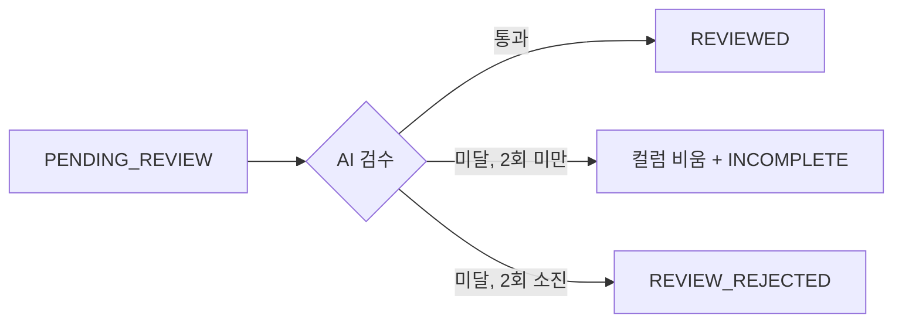

# PR 작성

리뷰어가 **제목만 보고 무슨 일인지 알고**, 본문 첫 줄만 보고 판단 근거를 얻게 쓴다.

## 제목

```
<접두어>: <이 PR이 한 일>
```

접두어는 `feat:` 또는 `fix:` 가 기본이다. 코드 동작이 바뀌지 않는 PR만 `chore:` / `docs:` / `refactor:` / `test:` 를 쓴다.

뒤에는 커밋 요약이 아니라 **사람이 읽는 한 문장**을 쓴다. 판단 기준: 이 저장소를 모르는 동료가 제목만 보고 무슨 일인지 아는가.

| | |
|---|---|
| ✅ | `feat: 음식 데이터 사람 승인 전 LLM 최종 검수 배치 추가` |
| ✅ | `fix: 번역 채점 누락 시 멀쩡한 번역까지 폐기되던 문제` |
| ❌ | `채점 모델 GPT-5-mini 전환 및 .env 키 주입 지원` (접두어 없음) |
| ❌ | `feat: KB-286 구현` (뭘 했는지 없음) |
| ❌ | `feat: scoring.py, graph.py 수정` (파일명은 정보가 아니다) |

## 본문

본문은 아래 네 섹션으로 구성된다. 순서를 지키고, 여기 없는 섹션은 만들지 않는다.

````markdown
## 관련 이슈

- [KB-286](https://simhani1.atlassian.net/browse/KB-286)

## 무엇을, 왜

한 줄 요약 — <이 PR이 하는 일 한 문장>

<이 작업이 왜 필요했는지. 어떤 문제가 있었고 왜 지금 푸는지.
변경 목록이 아니라 배경을 쓴다 — 무엇을 바꿨는지는 아래 섹션이 맡는다.>

## 주요 변경 사항

- **<영역>** — <바뀐 것과 그렇게 한 이유>
- **<영역>** — <바뀐 것과 그렇게 한 이유>

## 흐름도

```mermaid
<변경 후 동작>
```
````

### 각 섹션 채우는 법

**관련 이슈** — 지라 키와 링크. 브랜치명에서 키를 뽑는다 (`kb-286-food-review` → `KB-286`). 링크는 `https://simhani1.atlassian.net/browse/<KEY>`. 키를 못 찾으면 지어내지 말고 사용자에게 묻는다.

**무엇을, 왜** — `한 줄 요약 —` 로 시작하는 한 문장을 먼저 쓰고, 빈 줄 뒤에 배경을 쓴다. 배경은 *문제*를 쓰는 자리다. "무엇을 바꿨다"가 아니라 "무엇이 문제였다".

**주요 변경 사항** — 리뷰어가 이해하는 단위(기능·모듈·동작)로 묶는다. 커밋 단위로 나열하지 않는다 — 커밋 목록은 PR 화면에 이미 있다. 각 항목은 바뀐 것과 **그렇게 한 이유**를 함께 적는다.

**흐름도** — mermaid로 그린다(깃허브가 PR 본문에서 렌더링한다). 동작 흐름·상태 전이·컴포넌트 간 호출이 바뀐 PR이면 필수. 설정값 변경이나 문서 수정처럼 흐름이 그대로면 이 섹션을 통째로 뺀다.



## 흔한 실수

| 실수 | 고침 |
|---|---|
| 제목에 접두어 없음 | `feat:` 또는 `fix:` 부터 쓰고 시작 |
| "무엇을, 왜"에 변경 목록을 씀 | 거기는 배경 자리. 목록은 "주요 변경 사항"으로 |
| 커밋별로 나열 | 리뷰어가 이해하는 단위로 묶기 |
| 체크리스트·설정값 덤프 등 섹션 추가 | 네 섹션 외에는 만들지 않는다 |
| 흐름 안 바뀐 PR에 억지 흐름도 | 섹션째 뺀다 |
