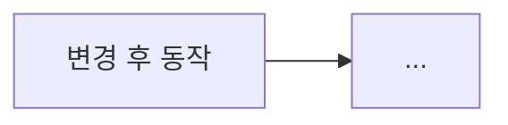

<!--
제목: <feat:|fix:> <이 PR이 한 일>
       코드 동작이 안 바뀌면 chore:/docs:/refactor:/test: 도 가능.
       저장소를 모르는 동료가 제목만 보고 무슨 일인지 알게 쓴다.
채우는 법은 .claude/skills/writing-pull-requests/SKILL.md 참고.
-->

## 관련 이슈

<!-- 브랜치명에서 지라 키를 뽑는다: kb-286-food-review → KB-286 -->
- [KB-](https://simhani1.atlassian.net/browse/KB-)

## 무엇을, 왜

한 줄 요약 —

<!-- 어떤 문제가 있었고 왜 지금 푸는지. 변경 목록이 아니라 배경을 쓴다. -->

## 주요 변경 사항

<!-- 리뷰어가 이해하는 단위(기능·모듈·동작)로 묶는다. 커밋 단위로 나열하지 않는다. -->
- **영역** — 바뀐 것과 그렇게 한 이유

## 흐름도

<!--
동작 흐름·상태 전이·컴포넌트 간 호출이 바뀐 PR이면 필수.
흐름이 그대로면(설정값 변경, 문서 수정 등) 이 섹션을 통째로 지운다.
-->

