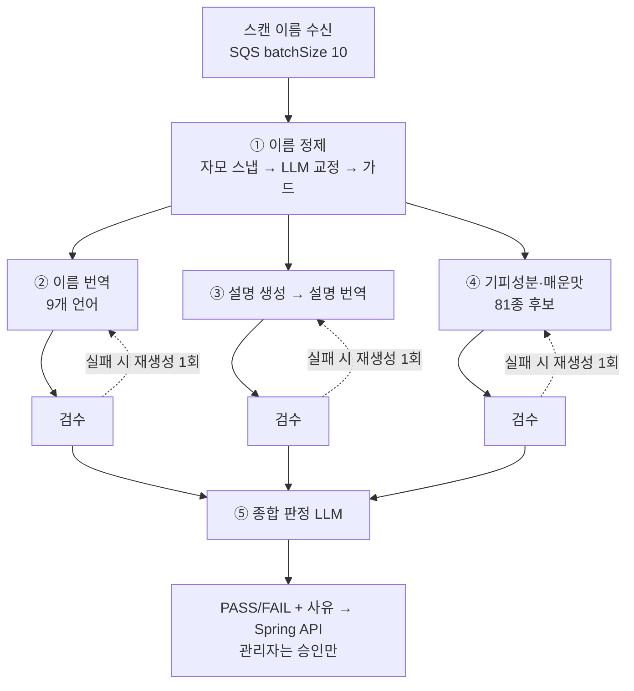

# kbap-langchain

음식 콘텐츠의 **생성과 검수를 전부 담당하는 LangGraph 파이프라인**.

kbap(Spring) 콘텐츠 배치의 LLM 로직을 이쪽으로 옮겨 없애는 것이 목표다.
이관이 끝나면 스프링에는 수집(Vision OCR)·저장·SQS 발행·관리자 승인 UI만 남고,
프롬프트·모델·평가·관측(Langfuse)은 전부 이 저장소에서 관리한다.

## 파이프라인



재시도 후에도 실패한 분기는 사유를 그대로 안고 판정·반영까지 흘러가 관리자가 열람한다.

## 구조

```
main.py            # 단일 진입점 — CLI 서브커맨드, Lambda 는 main.handler
src/kbap/
  content.py       # 본체: 콘텐츠 그래프 + 생성/검수 노드 + SQS 핸들러
  review.py        # 과도기: 스프링이 생성한 콘텐츠의 검수 전용 배치 (이관 완료 시 은퇴)
  namefix.py       # 이름 정제 — 파이프라인 첫 단계, content 가 재사용
notebooks/content_pipeline.ipynb   # 그래프 시각화·단건 실행
```

## 실행

```bash
uv sync
cp .env.example .env               # LLM·Langfuse·kbap 키

uv run python main.py review --dry-run --limit 5      # 검수 배치 (과도기)
uv run python main.py namefix --input names.json      # 이름 정제만 (디버깅)
uv run jupyter lab                                    # 콘텐츠 그래프 전체 실행
uv run pytest
```

Langfuse 키가 `.env`에 있으면 음식 1건 = 트레이스 1개로 자동 기록된다.

## 프롬프트 관리

프롬프트 11개의 소스는 **Langfuse(production 라벨)** 다. UI에서 수정하고 라벨을 옮기면
코드 배포 없이 반영되고, 라벨을 이전 버전으로 돌리면 롤백이다. 코드의 `*_TEMPLATE` 상수는
최초 업로드 원본이자 Langfuse 접속 불가 시 폴백이며, `{{candidate_codes}}`·`{{langs}}` 등
코드 계약이 걸린 값은 변수로 주입되므로 UI에서 편집하지 않는다.
테스트는 키를 지우고 폴백 경로만 검증한다(`tests/conftest.py`).

## 남은 이관 작업

- kbap 결과 반영 API 계약 확정 → `content.py` 의 POST 노드 연결
- SQS 메시지 스키마 확정 (`{"foodId", "scannedName"}` 초안)
- Lambda 컨테이너 배포 (batchSize 10 · ReportBatchItemFailures · maxConcurrency 로 RPM 제어)
- 기피성분 정확도 필요 시: 다중 모델 합의(스프링 방식) 또는 web_search 도구
