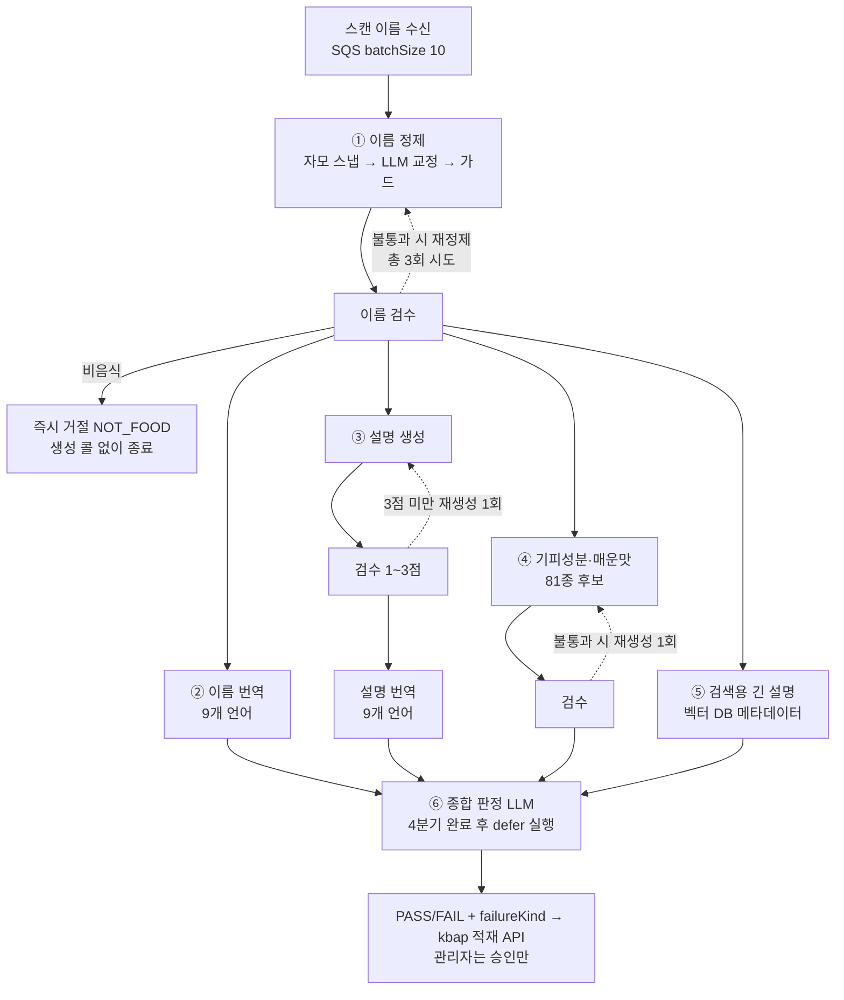

# kbap-langchain

음식 콘텐츠의 **생성과 검수를 전부 담당하는 LangGraph 파이프라인**.

kbap(Spring) 콘텐츠 배치의 LLM 로직을 이쪽으로 옮겨 없애는 것이 목표다.
이관이 끝나면 스프링에는 수집(Vision OCR)·저장·SQS 발행·관리자 승인 UI만 남고,
프롬프트·모델·평가·관측(Langfuse)은 전부 이 저장소에서 관리한다.

## 파이프라인



- **이름 검수가 입구 게이트다.** 비음식은 재정제해도 음식이 안 되므로 즉시 `NOT_FOOD`로
  끝내 생성 콜을 아끼고, 품질 불통과만 재정제 루프를 탄다(초회 포함 총 3회 시도).
- **번역은 검수하지 않는다.** 9개 언어 전수·빈 값 금지는 pydantic 경계가 보장한다.
  설명 검수는 한국어 한 줄만 보고, 통과한 설명으로만 번역을 만든다.
- **긴 설명은 판정에 참여하지 않는다.** 화면 미노출 검색 메타데이터라 검수·judge 를
  거치지 않고 join만 한다.
- **기피성분은 fail-closed.** judge 가 통과시켜도 기피성분 검수 불통과면 코드가
  `INGREDIENT_GUARD`로 뒤집는다 — 알레르기 데이터는 오통과가 누락보다 위험하다.
- 재시도 후에도 실패한 분기는 사유를 그대로 안고 판정까지 흘러가 관리자가 열람한다.
  탈락 사유는 `failureKind`(NOT_FOOD / INGREDIENT_GUARD / JUDGE_REJECTED)로 구분된다.

## 구조

```
src/kbap/
  main.py          # 단일 진입점 — uv run kbap <cmd>, Lambda 는 kbap.main.handler
  content.py       # 본체: 콘텐츠 그래프 + 생성/검수 노드 + SQS 핸들러 + 적재 페이로드
  review.py        # 과도기: 스프링이 생성한 콘텐츠의 검수 전용 배치 (이관 완료 시 은퇴)
  namefix.py       # 이름 정제 — 파이프라인 첫 단계, content 가 재사용
  prompts.py       # 프롬프트 템플릿 전부 (소스는 Langfuse, 여기는 폴백)
scripts/upload_prompts.py          # 프롬프트 레지스트리 → Langfuse 최초 업로드
notebooks/content_pipeline.ipynb   # 그래프 시각화·단건 실행
config.yaml                        # 노드별 모델·타임아웃·동시성
deploy.sh                          # arm64 이미지 → ECR → Lambda 코드 업데이트
```

## 실행

```bash
uv sync
cp .env.example .env               # LLM·Langfuse·kbap 키

uv run kbap review --dry-run --limit 5      # 검수 배치 (과도기)
uv run kbap namefix --input names.json      # 이름 정제만 (디버깅)
uv run jupyter lab                          # 콘텐츠 그래프 전체 실행
uv run pytest
```

Langfuse 키가 `.env`에 있으면 음식 1건 = 트레이스 1개로 자동 기록된다.

## 배포

`./deploy.sh` — arm64 컨테이너 이미지를 빌드해 ECR `kbap/langchain`에 푸시하고
Lambda `kbap-generate-content` 코드를 갱신한다(프로필 `kbap-lambda-deployer`).
SQS 트리거는 batchSize 10 · ReportBatchItemFailures · maxConcurrency 로 RPM을 제어한다.
메시지 계약: `{"scannedName": <str>, "foodId": <int>, "outboxId": <int>}` — foodId·outboxId 는
필수(양수)이며 적재 API 본문에 그대로 왕복된다. 위반 메시지는 그래프 실행 없이 DLQ 행.

## 프롬프트 관리

프롬프트 10개의 소스는 **Langfuse(production 라벨)** 다. UI에서 수정하고 라벨을 옮기면
코드 배포 없이 반영되고, 라벨을 이전 버전으로 돌리면 롤백이다. 코드의 `*_TEMPLATE` 상수는
최초 업로드 원본이자 Langfuse 접속 불가 시 폴백이며, `{{candidate_codes}}`·`{{langs}}` 등
코드 계약이 걸린 값은 변수로 주입되므로 UI에서 편집하지 않는다.
과도기 검수 배치(`review.py`)의 프롬프트는 Langfuse 에서 제거됐고 코드 폴백으로만 돈다.
테스트는 키를 지우고 폴백 경로만 검증한다(`tests/conftest.py`).

## 남은 이관 작업

- 과도기 배치(`review.py`) 은퇴 — 생성까지 전량 이관되면 삭제
- 기피성분 정확도 필요 시: 다중 모델 합의(스프링 방식) 또는 web_search 도구
